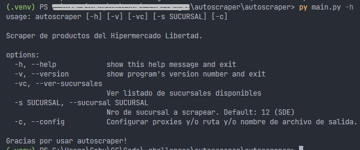
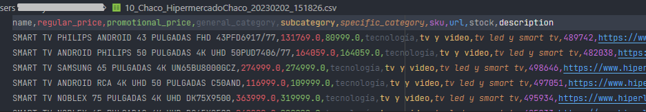

# Scraper HL

> *Este repositorio corresponde al challenge Python Web Scraping proporcionado por Autoscraping.*

`autoscraper` es una app cli que permite descargar información sobre los productos disponibles en las distintas sucursales del Hipermercado Libertad.

## Instalación
1. Crear una carpeta para el proyecto en la máquina local 

2. Clonar el proyecto en la carpeta creada
```sh
git clone git@github.com:gonzalezgbr/autoscraper.git .
```

3. Crear un entorno virtual usando `venv`
```sh
py -m venv venv
```

4. Activar el entorno creado
```sh
venv/Scripts/Activate
```

5. Instalar los paquetes necesarios desde el archivo de requerimientos
```sh
pip install -r autoscraper/requirements.txt
```
6. Ejecutar la app desde la terminal
```sh
py autoscraper/main.py
```

## Ejecución

- El scraper tiene como parámetro opcional el nro de sucursal de donde se quiere descargar la info de los productos. Si no se proporciona se usa la sucursal 12 (SDE).
```sh
py autoscraper/main.py -s 8
```
- Además, se pueden configurar la ruta y/o nombre del archivo de salida, y los proxies a utilizar. 
    - Si no se proporciona un archivo, los datos se guardan en la carpeta home del usuario en un archivo de nombre `{nro sucursal}_{nombre sucursal}_{fecha}_{hora}.csv`. 
    - Si no se proporcionan proxies se usa la configuración default del sistema.
```sh
py autoscraper/main.py -c
```
- Para ver los números de sucursales disponibles:
```sh
py autoscraper/main.py -vc
```
- Para ver todas estas opciones:
```sh
py autoscraper/main.py -h
```



## Breve descripción del proyecto

El proyecto se estructura en 4 archivos principales:
- `main.py` es el script de ejecución. Convoca a las funciones de cada módulo para obtener sucursales y categoría, y descargar, procesar y almacenar los datos de los productos de la sucursal elegida. 
- `storescraper.py` contiene una clase que descarga las sucursales disponibles con su id.
- `categoryscraper.py` contiene la clase que descarga los datos de las categorías y subcategorías de la sucursal seleccionada.
- `scraper.py` descarga los datos de todos los productos de la sucursal seleccionada. 


Adicionalmente: 
- el archivo `models.py` contiene las clases que representan las EDs usadas para procesar las categorías, subcategorías, sucursales y productos. 
- en el archivo `utils.py` se encuentran las funciones usadas para chequear/crear la ruta de guardado, generar el nombre de archivo default y encontrar el nombre de una sucursal según su id.
- en la carpeta `config` se encuentra el archivo `urls.py` que se encarga de construir las urls de descarga en base a un conjunto de urls base; y el archivo `config.env` donde se guardan los parámetros: ruta y proxies.

Sobre el archivo de salida:
- Los datos descargados para cada producto son los solicitados en la consigna, más las subcategorías de nivel 1 y 2 del producto. 

- En el campo `description` se reemplazan las nuevas lineas por /NEWLINE/ para ajustar cada producto a una fila del archivo.
- Ante la falla del proceso durante la descarga, el archivo de salida contendrá los productos descargados hasta el momento.

## Hecho con
Este proyecto se desarrolló con `python`:
- `argparse` para procesar las opciones de linea de comandos.
- `pathlib` para gestionar con archivos y carpetas.
- `csv`, para persistir los archivos.
- `json`, para procesar los datos descargados.
- `requests`, para descargar los datos de la web.
- `playwright`, para descargar los datos de la web, previo procesamiento de js.
- `beautifulsoup`, para extraer ciertos datos del html obtenido por js.
- `dotenv`, para manejar las variables de entorno.

---

**By GG** · [`github` @gonzalezgbr](https://github.com/gonzalezgbr/) · [`linkedin` @gonzalezgbr](https://www.linkedin.com/in/gonzalezgbr/) 
